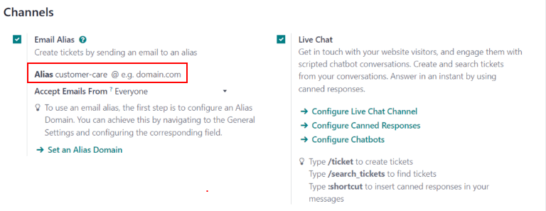
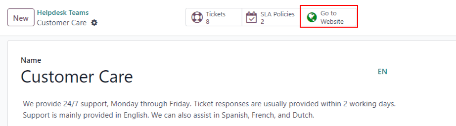
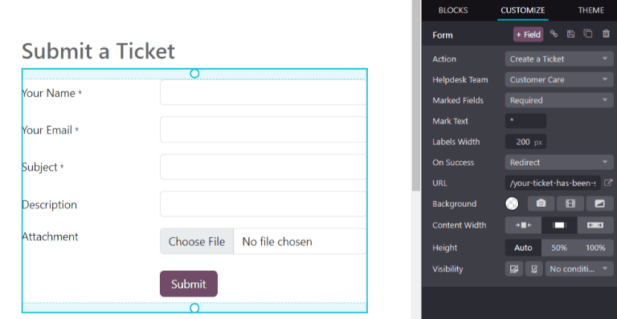

=======================
Start receiving tickets
=======================

Odoo *Helpdesk* offers multiple channels where customers can reach out for assistance, such as
email, live chat, and through a website's submission form. The variety of these contact options
provides customers with multiple opportunities to receive support quickly, while also giving the
support team the ability to manage multi-channel support tickets from one central location.

Enable channel options to submit tickets
========================================

Go to :menuselection:`Helpdesk app --> Configuration --> Helpdesk Teams` and choose an existing
team, or click :guilabel:`New` to :doc:`create a new team <getting_started>`.

On the team's settings page, scroll down to the :guilabel:`Channels` and :guilabel:`Help Center`
sections. Enable one or more channels by checking the respective boxes.

- :ref:`Email Alias <receiving_tickets/email-alias>`
- :ref:`Live Chat <receiving_tickets/live-chat>`
- :ref:`Website Form <receiving_tickets/website-form>`

.. _receiving_tickets/email-alias:

Email Alias
-----------

The *Email Alias* setting automatically creates tickets from messages sent to that team's specified
email alias.

When a new *Helpdesk* team is created, an email alias is created for it. This alias can be changed
on the team's settings page. To change a *Helpdesk* team's email alias, navigate to
:menuselection:`Helpdesk app --> Configuration --> Helpdesk Teams` and click on a team name to open
its settings page. Scroll to :menuselection:`Channels--> Email Alias`. In the :guilabel:`Alias`
field, type the desired name for the team's email alias.

.. note::
   If the database does not have a custom domain already configured, click :guilabel:`Configure a
   custom domain` to be redirected to the :guilabel:`Settings` page. From there, enable
   :guilabel:`Custom Email Servers`.

         Helpdesk.

When an email is received, the subject line from the email becomes the title of a new *Helpdesk*
ticket. The body of the email is also added to the ticket under the :guilabel:`Description` tab and
in the ticket's :guilabel:`Chatter`.

.. important::
   The preceding steps are for **Odoo Online** and **Odoo.sh** databases. For **On-premise**
   databases, additional configuration for custom email servers and email aliases may be required.

.. _receiving_tickets/live-chat:

Live Chat
---------

The *Live Chat* feature allows website visitors to connect directly with a support agent or chatbot.
During these conversations, *Helpdesk* tickets can be instantly created by using the :doc:`response
command </applications/websites/livechat/responses>` `/ticket`.

To enable *Live Chat*, navigate to the :menuselection:`Configuration --> Helpdesk Teams` list view,
select a team, and on the :guilabel:`Teams` settings page, click the checkbox next to
:guilabel:`Live Chat`, under the :guilabel:`Channels` heading.

.. note::
   If this is the first time *Live Chat* has been enabled on the database, the page may need to be
   saved manually and refreshed before any further steps can be taken.

With the :guilabel:`Live Chat` setting enabled, click on :guilabel:`View Channels`. Then, on the
:guilabel:`Website Live Chat Channels` dashboard, select the kanban card for the channel that was
created for the *Helpdesk* team, or create a :guilabel:`New` one if necessary.

Customize the live chat channel
~~~~~~~~~~~~~~~~~~~~~~~~~~~~~~~

When the kanban card for a live chat channel is clicked on the :guilabel:`Website Live Chat
Channels` dashboard, Odoo directs the page to the channel form. From there, the :guilabel:`Channel
Name` can be edited, however Odoo names this to match the *Helpdesk* team's kanban pipeline, by
default.

.. example::
   If a *Helpdesk* team is named `Customer Care`, a *Live Chat* channel is created with the same
   name.

   .. image:: receiving_tickets/receiving-tickets-live-chat-new-channel.png
      :align: center
      :alt: View of the kanban cards for the available Live Chat channels.

On the channel form, navigate through the tabs to complete the setup.

Add operators
*************

*Operators* are the users who act as agents and respond to live chat requests from customers.
The user who originally created the live chat channel is added by default.

To add additional users, navigate and click on the live chat channel from the :guilabel:`Website
Live Chat Channels` dashboard, and on the :guilabel:`Operators` tab, click :guilabel:`ADD`.

Then, click the checkbox next to the users to be added, and click :guilabel:`SELECT`.
:guilabel:`New` operators can be created and added to the list, as well, by filling out the
:guilabel:`Create Operators` form and then clicking :guilabel:`SAVE & CLOSE` (or :guilabel:`SAVE &
NEW` for multiple record creations).

As well, current operators can be edited or removed by clicking on their respective boxes in the
:guilabel:`Operators` tab, and then adjusting their form values, or by using one of the form buttons
located at the bottom of the form, such as :guilabel:`REMOVE`.

.. tip::
   Users can add themselves as an operator by clicking the :guilabel:`Join` button on a *Live Chat*
   channel.

   .. image:: receiving_tickets/receiving-tickets-join-live-chat.png
      :align: center
      :alt: View of a live chat channel kanban card with the join button emphasized.

Modify channel options
**********************

The :guilabel:`Options` tab contains the visual and text settings for the live chat window.

Change the text in the :guilabel:`Text of the Button` field to update the greeting displayed in the
text bubble when the live chat button appears on the website.

Edit the :guilabel:`Welcome Message` to change the message a visitor sees when they open the chat
window. This message appears as though it is sent by a live chat operator, and should be an
invitation to continue the conversation.

Edit the :guilabel:`Chat Input Placeholder` to change the text that appears in the box where
visitors type their replies.

Change the :guilabel:`Livechat Button Color` and the :guilabel:`Channel Header Color` by clicking a
color bubble to open the color selection window. Click the refresh icon to the right of the color
bubbles to reset the colors to the default selection.

.. tip::
   Color selection, for the button or header, can be made manually, or through RGB, HSL or HEX code
   selection. Different options are available, depending on the operating system.

Create channel rules
********************

The :guilabel:`Channel Rules` tab determines when the live chat window opens on the website by logic
of when a :guilabel:`URL Regex` action is triggered (e.g., a page visit).

Edit existing rules, or create a new one by clicking :guilabel:`Add a line`, and fill out the pop-up
form details based on how the rule should apply.

To include a :guilabel:`Chatbot` on this channel, select it from the drop-down menu. If the chatbot
should only be active when no operators are available, check the box labeled :guilabel:`Enabled only
if no operator`.

.. note::
   If a chatbot is added to a live chat channel, then three new smart buttons appear on the channel
   settings form: :guilabel:`Chatbots`, :guilabel:`Sessions`, and :guilabel:`% Happy`.

   - :guilabel:`Chatbots`: click here to create and update the chatbot *script*. Each line in the
     script contains a :guilabel:`Message`, :guilabel:`Step Type`, :guilabel:`Answers`, and
     conditional *Only If* logic that applies when certain pre-filled answers are chosen. To create
     more steps in the script, click :guilabel:`Add a line` and fill out the script steps form
     according to the desired logic.
   - :guilabel:`Sessions`: where live chat sessions are recorded in order of descending
     :guilabel:`Session Date`, by default. Each record includes the :guilabel:`Attendees` involved
     in the live chat session, the :guilabel:`# Messages`, as well as any :guilabel:`Rating` that
     was received when the session ended.
   - :guilabel:`% Happy`: includes a log of ratings that were left by live chat attendees, and are
     labeled by date, time, and the support agent who was responsible for the live chat session.

Add the URLs for the pages where the channel should appear to in the :guilabel:`URL Regex` field. If
this channel should only be available to users in specific countries, add them to the
:guilabel:`Country` field. If this field is left blank, the channel will be available to all site
visitors.

.. image:: receiving_tickets/receiving-tickets-channel-rules.png
   :align: center
   :alt: View of the kanban cards for the available Live Chat channels.

Use the live chat widget
************************

The :guilabel:`Widget` tab on the live chat channel form offers a website widget that can be added
to third party platforms. Additionally, a short code is available, that can provide instant access
to a live chat window.

The live chat :guilabel:`Widget` can be applied to websites created through Odoo by navigating to
the :menuselection:`Website app --> Configuration --> Settings`. Then scroll to the :guilabel:`Live
Chat` section, and select the channel to add to the site. Click :guilabel:`Save` to apply.

To add the widget to a website created on a third-party platform, click :guilabel:`COPY` and paste
the code into the `<head>` tag on the site.

Likewise, to send a live chat session to a customer or supplier, click the second :guilabel:`COPY`
button which contains a link to join directly.

Create a support ticket from a live chat session
~~~~~~~~~~~~~~~~~~~~~~~~~~~~~~~~~~~~~~~~~~~~~~~~

Once live chat is enabled, operators are able to communicate with site visitors in real time.

During the conversation, an operator can use the shortcut :doc:`command
</applications/websites/livechat/responses>` `/ticket` to create a ticket without leaving the chat
window. The transcript from the conversation is added to the new ticket, under the
:guilabel:`Description` tab.

.. _receiving_tickets/website-form:

Website Form
------------

Enabling the *Website Form* setting adds a new page to the website with a customizable form. A new
ticket is created once the required form fields are filled out and submitted.

To activate the website form, navigate to a team's settings page under :menuselection:`Configuration
--> Helpdesk Teams`. Find the :guilabel:`Website Form` feature under the :guilabel:`Help Center`
section, and check the box.

After the feature is activated, click the :guilabel:`Go to Website` smart button at the top of the
that :guilabel:`Teams` settings page to view and edit the new website form, which is created
automatically by Odoo.

.. note::
   After enabling the website form, the *Teams* settings page may need to be refreshed before the
   *Go to Website* smart button appears.

   As well, if a *Help Center* is published, the smart button navigates there first. Simply click
   the :guilabel:`Contact Us` button at the bottom of the forum to navigate to the ticket
   submission form.

         Odoo Helpdesk.

Customize the website ticket form
~~~~~~~~~~~~~~~~~~~~~~~~~~~~~~~~~

To customize the default ticket submission form, click the :guilabel:`Edit` button in the upper
right corner of the page. Then click on one of the fields in the form.

Add, remove, or update fields as necessary to alter the information submitted by customers. Fields
can be made marked as :guilabel:`Required`, by toggling the switch from gray to blue in the website
builder's editor window, located under the :guilabel:`Field` section. As well, other pertinent field
information can be edited here, such as:

- :guilabel:`Type`: which matches an Odoo model value to the field (e.g. `Customer Name`).
- :guilabel:`Input Type`: to determine what type of input the field should be, like `Text`, `Email`,
  `Telephone` or `URL`.
- :guilabel:`Label`: to give the form field a label (e.g. `Full Name`, `Email Address`, etc.). Also
  control the label position on the form by using the nested :guilabel:`Position` options.
- :guilabel:`Description`: which, optionally, adds an editable line under the input box to provide
  additional contextual information related to the field.
- :guilabel:`Placeholder`: to add a sample input value.
- :guilabel:`Default value`: to add common use case values that most customers would find valuable
- :guilabel:`Required`: which sets the field as mandatory before the form can be submitted.
- :guilabel:`Visibility`: to allow for absolute or conditional visibility of the field. Nested
  options, such as device visibility, appear when certain options are selected.

.. tip::
   Text blocks can be added in the farthest 1/3 column of the ticket form page, next to the ticket
   form. This is an ideal place to include team information such as additional contact details,
   hours, or common helpful articles that link to the :guilabel:`Forum`.

Once the form has been optimized and is ready for public use, :guilabel:`Save` the changes, and then
publish the form by clicking on the :guilabel:`Unpublished` button.

Prioritizing tickets
====================

All tickets include a :guilabel:`Priority` field. The highest priority tickets appear at the top of
the kanban and list views.

.. image:: receiving_tickets/receiving-tickets-priority.png
   :align: center
   :alt: View of a team's kanban view and the prioritized tasks in Odoo Helpdesk.

The priority levels are represented by stars:

   - 0 stars = *Low Priority*
   - 1 star = *Medium Priority*
   - 2 stars = *High Priority*
   - 3 stars = *Urgent*

Tickets are set to low priority (0 stars) by default. To change the priority level, select the
appropriate number of stars on the kanban card, or on the ticket.

.. warning::
   As priority levels can be used as criteria for assigning :doc:`SLAs <sla>`, changing the priority
   level of a ticket can alter the :abbr:`SLA (Service Level Agreement)` deadline.

.. seealso::
   - :doc:`/applications/services/helpdesk/advanced/close_tickets`
   - :doc:`/applications/general/email_communication/email_servers`
   - :doc:`/applications/websites/livechat`
